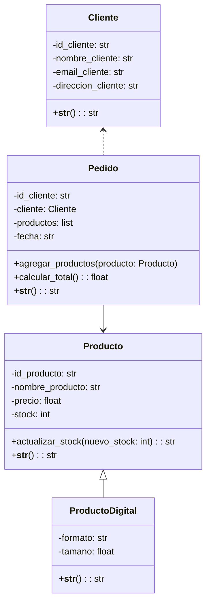

# 🛠 Manual Técnico - Tienda Virtual

---

## 📐 Arquitectura del Software

El sistema está organizado en una arquitectura modular basada en Python, separando la lógica de negocio, los datos y la interfaz de usuario por capas funcionales. Cada módulo representa una responsabilidad distinta:

- **cliente.py**: Gestión de datos de clientes.
- **producto.py / producto_digital.py**: Modelado de productos físicos y digitales.
- **pedido.py**: Gestión de pedidos de clientes.
- **funciones_menu.py**: Lógica funcional para gestionar productos, clientes, pedidos y reseñas.
- **menu.py**: Interfaz de usuario mediante menús en consola.
- **sistema.py**: Utilidades del sistema y flujo general del programa.
- **main.py**: Punto de entrada del sistema.

Esta estructura modular favorece la escalabilidad y el mantenimiento del sistema, permitiendo fácilmente la inclusión de nuevas funcionalidades o la modificación de las existentes sin afectar al resto del código.

---

## 🧱 Diagrama de Clases



Este diagrama representa la relación entre entidades principales del sistema, destacando la herencia de `ProductoDigital` desde `Producto`, y las asociaciones entre `Pedido`, `Cliente` y `Producto`.

---

## 🧾 Explicación del Código

### `cliente.py`
Define la clase `Cliente` con atributos como `id_cliente`, `nombre`, `email` y `dirección`. Se usan propiedades privadas para garantizar encapsulamiento y control de acceso.

### `producto.py`
Contiene la clase `Producto`, que representa un artículo con ID, nombre, precio y stock. Tiene métodos para actualizar el stock y mostrar los detalles del producto.

### `producto_digital.py`
Extiende la clase `Producto` con la clase `ProductoDigital`, que añade atributos como `formato` y `tamaño`. Representa productos como ebooks o software descargable.

### `pedido.py`
Define la clase `Pedido`, que asocia un cliente con una lista de productos comprados y su fecha. Tiene métodos para agregar productos y calcular el total del pedido.

### `funciones_menu.py`
Contiene todas las funciones que hacen funcionar el sistema, como:
- **Gestión de productos**: agregar, listar, actualizar stock.
- **Gestión de clientes**: crear y listar clientes.
- **Gestión de pedidos**: crear pedidos, mostrar detalles, calcular total.
- **Reseñas**: placeholder para futuras funcionalidades.

Utiliza listas y diccionarios para manejar los datos en tiempo de ejecución.

### `menu.py`
Implementa la navegación por menús en consola, ofreciendo una experiencia interactiva al usuario. Llama a las funciones definidas en `funciones_menu.py`.

### `sistema.py`
Incluye funciones de utilidad como pausar el programa (`input("Presiona Enter...")`) y limpiar la pantalla (`os.system("cls" o "clear")`).

### `main.py`
Archivo principal que inicializa y ejecuta el menú principal. Es el punto de entrada al sistema.

---

## ⚙️ Instalación y Dependencias

### 📋 Requisitos
- Python 3.8 o superior
- Consola compatible (Linux, macOS, Windows)

### 📦 Dependencias
El proyecto **no** depende de librerías externas. Todo está desarrollado con módulos estándar de Python.

### 📥 Instrucciones de Instalación

1. **Clonar el repositorio**:
   ```bash
   git clone https://github.com/usuario/tienda_virtual.git
   cd tienda_virtual
   ```

2. **Ejecutar el programa**:
   ```bash
   python main.py
   ```

---

## ✅ Consideraciones Finales

- Este sistema es una aplicación de consola orientada a objetos, ideal como base para sistemas más complejos.
- Se pueden agregar funcionalidades como:
  - Persistencia con bases de datos.
  - Validaciones más estrictas.
  - Interfaz gráfica (GUI) o web.
  - Módulo de reseñas activo.

> 💡 Recomendación: para proyectos reales, implementar un sistema de autenticación, validaciones robustas y pruebas automatizadas.

---
